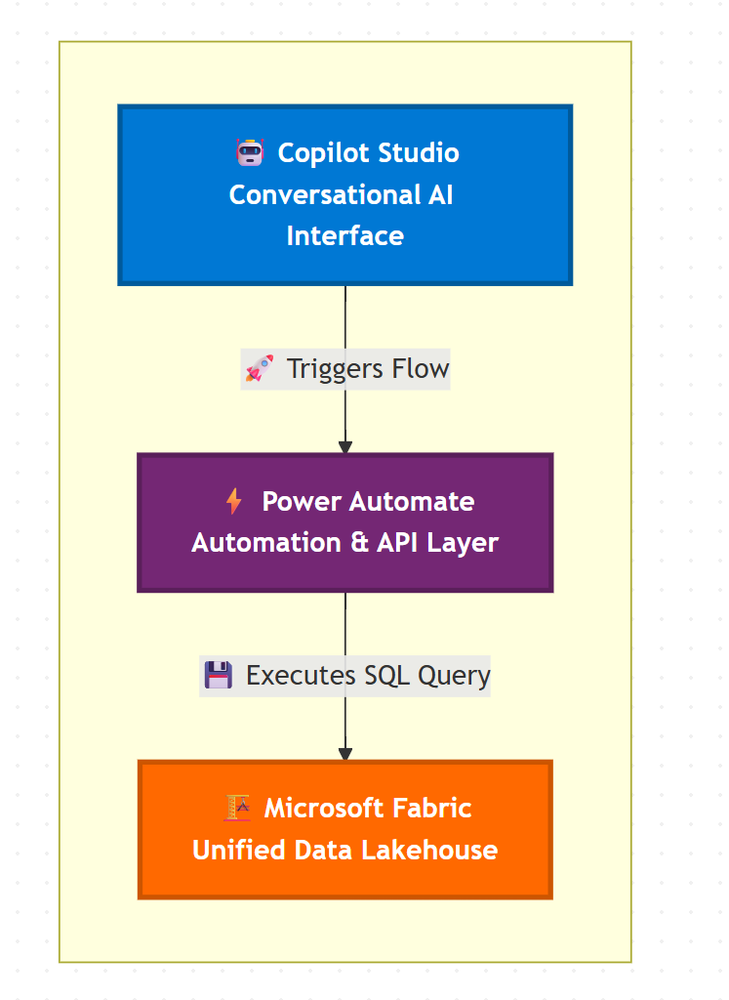

# Clinical Trial AI Navigator

## Project Overview

This project is a proof-of-concept for an AI-powered conversational agent designed to help medical researchers accelerate the process of finding eligible candidates for clinical trials. The agent, built with Microsoft Copilot Studio, allows a user to specify a diagnosis in natural language and receive a real-time count of eligible patients from a data warehouse built on Microsoft Fabric.

This project demonstrates a complete, end-to-end implementation of a modern data and AI stack, from data engineering and modeling to conversational AI design and cloud automation.

## Architecture

The system is composed of three core cloud components that work in tandem:

1.  **Microsoft Fabric**: Serves as the unified data foundation. A Fabric Lakehouse consolidates and models patient and trial data into a final `eligiblecandidates` table.
2.  **Power Automate**: Acts as the secure middleware layer. A flow is triggered by the AI agent, which then runs a parameterized SQL query against the Fabric Lakehouse's SQL endpoint.
3.  **Microsoft Copilot Studio**: Provides the user-friendly conversational interface. The agent guides the user, captures their input, calls the Power Automate flow, and presents the final data-driven response.

## Key Features

- **Natural Language Querying**: Users can ask for information in plain English (e.g., "find candidates for diabetes").
- **Real-Time Data Integration**: The AI agent queries the data warehouse live, ensuring the information is always up-to-date.
- **Scalable Data Backend**: Built on Microsoft Fabric, the data backend can scale to handle massive datasets.
- **Secure and Modular**: Each component is decoupled, and the use of parameterized queries in Power Automate helps protect against injection attacks.

## Technical Showcase

### Data Engineering (Microsoft Fabric)

The data pipeline was implemented in a Fabric Notebook using PySpark. Key steps include:

- Ingesting raw source data (mock patient and trial info).
- Cleaning and transforming data, including handling missing values and incorrect data types.
- Renaming columns to be compatible with the Delta Lake format.
- Enriching the data by adding mock `Age` and `Diagnosis` columns to facilitate complex joins.
- Joining the two datasets into a final "gold" table (`dbo.eligiblecandidates`) based on eligibility criteria.

[Link to Notebook Code](fabric_notebooks/1_data_ingestion_and_modeling.py)

### Automation (Power Automate)

The core logic is contained in a single cloud flow that:

- Receives the `Diagnosis` as a text input from the Copilot.
- Executes a SQL query against the Fabric SQL Endpoint using the standard SQL Server connector.
- Returns the final candidate count as a number.

### Conversational AI (Copilot Studio)

The user-facing agent includes a topic with the following logic:

- **Triggers**: Activates on phrases like "find trial candidates".
- **Questions**: Asks the user for the specific diagnosis and stores the answer in a variable.
- **Actions**: Calls the Power Automate flow, passing the diagnosis variable as an input and receiving the count as an output.
- **Messages**: Responds to the user with the final count in a natural language sentence.

## Project Outcome

The final result is a functional AI agent that successfully fulfills the user's request.

## Future Improvements

- Expand the query to include more filter criteria (age range, gender, etc.).
- Develop the agent's ability to return not just the count, but also an anonymized list of candidate IDs.
- Implement more robust error handling in the Power Automate flow.
