# Clinical Trial AI Navigator - System Architecture

## Professional Cloud Architecture Diagram

```mermaid
flowchart LR
    subgraph " "
        A["🤖 Copilot Studio<br/>Conversational AI Interface"]
        B["⚡ Power Automate<br/>Automation & API Layer"]
        C["🏗️ Microsoft Fabric<br/>Unified Data Lakehouse"]
    end

    A -->|"🚀 Triggers Flow"| B
    B -->|"💾 Executes SQL Query"| C

    classDef copilotStyle fill:#0078D4,stroke:#005A9B,stroke-width:3px,color:#FFFFFF,font-weight:bold
    classDef automateStyle fill:#742774,stroke:#5A1F5A,stroke-width:3px,color:#FFFFFF,font-weight:bold
    classDef fabricStyle fill:#FF6900,stroke:#CC5500,stroke-width:3px,color:#FFFFFF,font-weight:bold

    class A copilotStyle
    class B automateStyle
    class C fabricStyle
```

### Architecture Overview

This diagram illustrates the data flow in the Clinical Trial AI Navigator system:

1. **Microsoft Copilot Studio** - Serves as the conversational AI interface where users interact with the system
2. **Power Automate** - Acts as the automation and API layer, processing requests and orchestrating data operations
3. **Microsoft Fabric** - Provides the unified data lakehouse for storing and querying clinical trial information

The arrows represent the key interactions:

- **Triggers Flow**: User interactions in Copilot Studio initiate automated workflows in Power Automate
- **Executes SQL Query**: Power Automate performs data operations against the Microsoft Fabric Lakehouse
